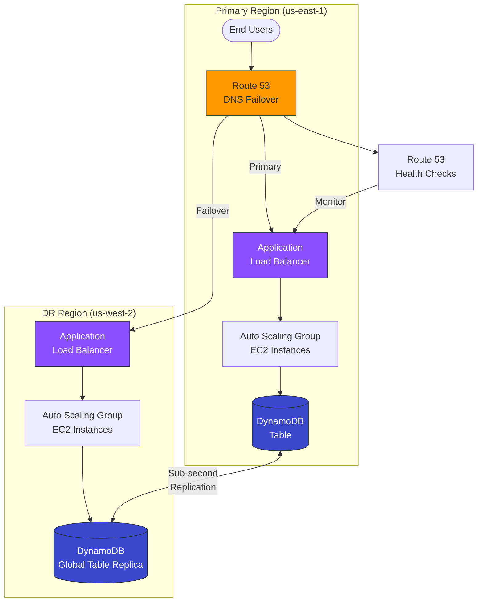

## The Architect's Note

Unlike generic exam dumps, ADH analyzes this scenario through the lens of a **Real-World CTO**, focusing on Trade-offs and FinOps impact.

While preparing for the **AWS SAA-C03**, many candidates get confused by **multi-region disaster recovery strategies**. In the real world, this is fundamentally a decision about **Recovery Time Objective (RTO) vs. Infrastructure Cost**. Let's drill into a simulated scenario.

---

## The Architecture Drill

### Scenario

**NovaMart**, a growing regional e-commerce platform, operates its order management system on AWS. The application runs on Amazon EC2 instances within an Auto Scaling group, fronted by an Application Load Balancer (ALB), and persists order data to an Amazon DynamoDB table. 

Following a recent competitor's 6-hour outage that resulted in $2M lost revenue, NovaMart's board has mandated that the platform must be accessible from a secondary AWS Region with **minimal downtime** in case of a regional failure. The engineering team must design a DR strategy that balances cost efficiency with rapid recovery.

### The Requirement

**Minimize Recovery Time Objective (RTO)** while maintaining operational simplicity and reasonable cost for a business-critical e-commerce workload.

### The Options

**A)** Pre-provision an Auto Scaling group and ALB in the DR region, configure the DynamoDB table as a global table for continuous replication, and configure DNS failover to point to the DR region's ALB.

**B)** Create an AWS CloudFormation template to provision EC2 instances, ALB, and DynamoDB table on-demand. Launch the stack when disaster strikes, and configure DNS failover to point to the DR region's ALB.

**C)** Create an AWS CloudFormation template to provision EC2 instances and ALB on-demand, configure DynamoDB as a global table for continuous replication, and configure DNS failover to point to the DR region's ALB.

**D)** Pre-provision an Auto Scaling group and ALB in the DR region, configure DynamoDB as a global table, create an Amazon CloudWatch alarm with a 10-minute evaluation period to trigger an AWS Lambda function that updates Amazon Route 53 to point to the DR region's ALB.

---

## The Decision Matrix

| Option | DR Strategy Type | Est. RTO | Est. Monthly Cost | Pros | Cons |
|--------|-----------------|----------|-------------------|------|------|
| **A** | Warm Standby | **< 1 min** | High (~$800-1500) | Fastest failover; fully automated; data always in sync | Highest ongoing cost for idle resources |
| **B** | Cold Standby | 30-60 min | Low (~$50-100) | Lowest cost; IaC maintained | Longest RTO; data loss risk; manual intervention likely |
| **C** | Pilot Light | 10-20 min | Medium (~$200-400) | Balanced cost; data protected | Compute provisioning adds latency; potential scaling issues |
| **D** | Warm Standby (Manual DNS) | **10-15 min** | High (~$800-1500) | Infrastructure ready; data in sync | Unnecessary complexity; delayed detection; not truly minimal RTO |

---

## The Architect's Analysis

### Correct Answer: **Option A**

### The Winning Logic

Option A represents the optimal **trade-off between RTO and operational reliability** for this scenario:

1. **Pre-provisioned Infrastructure = Near-Zero RTO**: With Auto Scaling groups and ALB already running in the DR region, the failover is purely a DNS cutover operation. Route 53 health checks can detect primary region failure and automatically redirect traffic within **30-60 seconds**.

2. **DynamoDB Global Tables = Zero Data Loss (RPO ≈ 0)**: Global tables provide **sub-second replication** across regions. When failover occurs, the DR region has current data—no restore operations, no data gaps.

3. **DNS Failover = Fully Automated**: Route 53's native health checks and failover routing policy eliminate human intervention. This is critical because disasters often occur at 3 AM when response times are longest.

4. **Operational Simplicity**: Unlike Option D's Lambda-based approach, Option A uses AWS's managed failover capabilities—fewer moving parts, fewer failure modes.

**The Cost Justification**: Yes, Option A costs more than Options B or C. But the question explicitly prioritizes **"minimal downtime."** For an e-commerce platform where downtime = lost revenue, paying $800-1500/month for instant failover is insurance, not waste.

### The Trap (Distractor Analysis)

#### Why not Option B?
**Fatal Flaw: RTO of 30-60 minutes violates "minimal downtime"**

- CloudFormation stack creation for EC2, ALB, and DynamoDB takes 15-30 minutes minimum
- DynamoDB table creation means **no data replication**—you'd need a separate backup/restore process, adding 15-30 more minutes
- This is a **Backup & Restore** strategy, appropriate for non-critical workloads, not e-commerce

#### Why not Option C?
**Good but not optimal: RTO of 10-20 minutes**

- DynamoDB Global Tables solve the data problem ✓
- But compute provisioning via CloudFormation still introduces 10-20 minute delays
- EC2 instances need time to: launch → pass health checks → register with ALB → warm up application
- For "minimal downtime," this latency is unacceptable when Option A offers near-instant failover

#### Why not Option D?
**Over-engineered and slower: The CloudWatch trap**

- 10-minute evaluation period means detection alone takes 10 minutes before Lambda even triggers
- Building custom DNS update logic via Lambda introduces failure points (IAM permissions, Lambda cold starts, Route 53 API throttling)
- **Why reinvent Route 53 health checks?** Native DNS failover is faster, more reliable, and already included in Route 53 pricing
- This option costs the same as Option A but delivers worse RTO

---

## The Blueprint

**Diagram Note:** Route 53 continuously monitors the primary ALB via health checks. Upon failure detection, DNS automatically resolves to the DR region's ALB, which is already serving traffic-ready EC2 instances connected to the synchronized DynamoDB global table replica.

---

## Real-World Application

### Exam Rule
> "For the SAA exam, when you see **'minimal downtime' + 'multi-region DR'**, always prioritize **pre-provisioned resources + native AWS failover mechanisms** (Route 53 DNS failover, DynamoDB Global Tables, Aurora Global Database)."

### Real World
In production environments, we would likely enhance this architecture with:

1. **Cost Optimization**: Run the DR Auto Scaling group at minimum capacity (1-2 instances) during normal operations, with scaling policies to expand during failover
2. **Active-Active Consideration**: For truly critical workloads, we might implement active-active across regions using Route 53 latency-based routing, turning "DR cost" into "performance investment"
3. **Chaos Engineering**: Regular failover drills using AWS Fault Injection Simulator to validate RTO claims
4. **FinOps Monitoring**: Tag DR resources separately and track them in AWS Cost Explorer to justify the investment to leadership

The exam simplifies reality—real DR planning involves runbooks, communication protocols, and testing cadences that extend far beyond infrastructure provisioning.

---

> **🚀 Master the Trade-offs, Become the Decision Maker.**
>
> Passing the exam is step one; mastering the strategic decision is step two. Don't miss the launch of our **Multi-Cloud FinOps Optimization Toolkit**.
>
> **👉 Subscribe to ADH Weekly Insights for exclusive early access and advanced strategy notifications!**

---

## Disclaimer

This is a study note based on simulated scenarios for the **AWS SAA-C03** exam. It is not an official question from AWS or any certification body.
