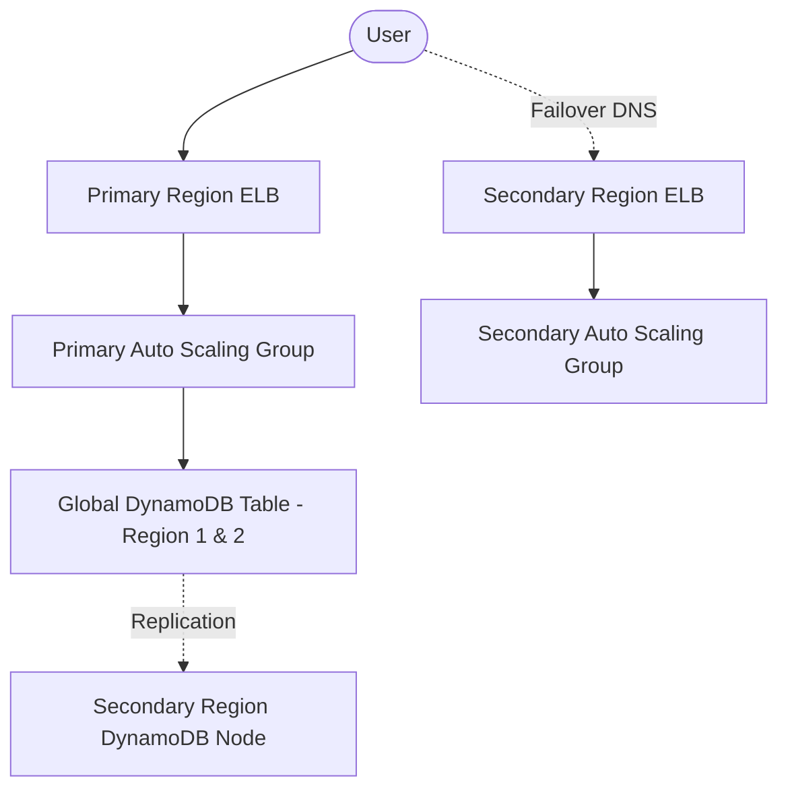

> ## Jeff's Notes
> 
> Unlike generic exam dumps, ADH analyzes this scenario through the lens of a **Real-World CTO**, focusing on Trade-offs and FinOps impact.
> 
> While preparing for the **AWS SAA** exam, many candidates get confused by **multi-region disaster recovery strategies and their associated downtime trade-offs**. In the real world, this is fundamentally a decision about **balancing low recovery time objectives (RTO) against operational complexity and cost**. Let's drill into a simulated scenario.

## The Blueprint: Target Solution

- **Diagram Note:**  
Users normally access the primary region's ELB and Auto Scaling group backed by a globally replicated DynamoDB. Upon failure, Route 53 DNS shifts traffic instantly to the pre-provisioned secondary region infrastructure with replicated data, ensuring minimal downtime.

---

## The Architecture Drill: Multi-Region Disaster Recovery for FinServ Apps

- **Scenario:**  
Acme Financial Technologies operates a heavily used trading application on AWS. The app runs inside an Auto Scaling group of Amazon EC2 instances behind an Elastic Load Balancer (ELB) in the US-East-1 region. Data storage uses a DynamoDB table to track live transaction states. To comply with strict business continuity policies, Acme needs a disaster recovery (DR) strategy that allows the application to fail over to a secondary AWS region with minimal downtime.

- **The Requirement:**  
Design a DR solution that minimizes unplanned downtime and ensures near-seamless failover while maintaining data consistency. The approach should be operationally efficient and cost-effective, suitable for an associate-level AWS architect role.

- **The Options:**

    A) Deploy a fully configured Auto Scaling group and ELB in a secondary region. Convert the DynamoDB table into a global table spanning both regions. Configure Route 53 DNS failover to switch traffic to the secondary region's ELB upon primary region failure.

    B) Prepare an AWS CloudFormation template for launching EC2 instances, ELB, and a DynamoDB table in the secondary region on-demand. Use DNS failover to point traffic to this region only after deployment completes.

    C) Deploy a CloudFormation template that provisions EC2 instances and ELB in the secondary region, but keep the DynamoDB table configured as a global table across both regions. Use DNS failover to redirect traffic when needed.

    D) Create an Auto Scaling group and ELB in the secondary region, configure DynamoDB global tables, and set up an Amazon CloudWatch alarm with a 10-minute evaluation period that triggers a Lambda function to update Route 53 DNS records to redirect traffic to the secondary region upon detecting failure.

---

## The Architect’s Analysis

- **Correct Answer:** **Option A**

- **The Winning Logic:**  
Option A represents the best balance for minimizing downtime in a disaster recovery scenario. It provisions ready-to-serve infrastructure (Auto Scaling group + ELB) in the secondary region upfront, meaning failover does not require waiting for resource creation during an outage. Using DynamoDB global tables ensures data is replicated across regions asynchronously but near real-time, keeping the secondary region's data state consistent. DNS failover via Route 53 allows rapid redirect of traffic between regions without manual intervention. This combination achieves a low RTO (minutes or less), aligning well with the DR requirement.

- **Trap (Distractor) Analysis:**  
  - **Option B:** Launching all resources on-demand during failover dramatically increases downtime. CloudFormation stack launch and instance boot-up times can be 10+ minutes, leading to unacceptable RTO. It's cost-efficient but impractical for minimal downtime needs.  
  - **Option C:** Only pre-creating EC2 and ELB without converting DynamoDB to a global table leaves the secondary region with a stale local table, risking data inconsistency or service failure. The DB layer is critical to failover readiness.  
  - **Option D:** While adding CloudWatch alarms and Lambda automation for DNS updates improves operational automation, the 10-minute alarm evaluation period itself introduces unnecessary delay. Immediate DNS failover using health checks or Route 53’s built-in failover is preferable for critical low-RTO systems.

---

## Real-World Application (Practitioner Insight)

- **Exam Rule:**  
For the exam, always pick **DynamoDB Global Tables** when you see a multi-region read/write scenario that requires low downtime and data replication.

- **Real World:**  
In practice, some organizations layer in active-active architectures with traffic split, or use more sophisticated Route 53 health checks for near-instant failover detection. Cost sensitivity may drive decisions to use on-demand CloudFormation with acceptable RTO instead. Additionally, integrating AWS Backup or cross-region snapshots might complement DR but on a longer RPO/RTO scale.

---

> **🚀 Master the Trade-offs, Become the Decision Maker.**  
>  
> Passing the exam is step one; mastering the strategic decision is step two. Don't miss the launch of our **Multi-Cloud FinOps Optimization Toolkit**.  
>  
> **👉 Subscribe to ADH Weekly Insights for exclusive early access and advanced strategy notifications!**

---

> #### Disclaimer  
>  
> This is a study note based on simulated scenarios for the **AWS SAA** exam. It is not an official question from the certification body.