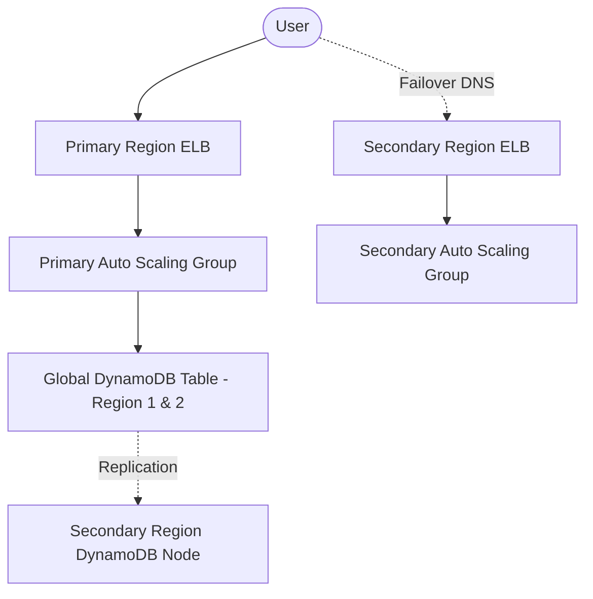

> ## 考试要点提示
> 
> 在 AWS SAA 认证考试中，当题目要求 **“最小化停机时间”** 或 **“低 RTO (Recovery Time Objective)”** 时，您的解决方案必须包含 **预先部署** 和 **实时数据复制** 的机制。请专注于 AWS 服务的内置功能。

---

## 模拟考试题：多区域灾难恢复

- **场景:** Acme 公司运营着一个高流量的交易应用，运行在 AWS US-East-1 区域的 EC2 Auto Scaling groups 后面，数据存储在 DynamoDB 表中。公司需要一个灾难恢复 (DR) 策略，确保应用能在主区域发生故障时，以 **最小停机时间** 切换到另一个 AWS 区域。

- **问题：**
设计一个 DR 解决方案，确保最小的停机时间 (低 RTO)，以下哪种方法最符合 AWS SAA 认证的最佳实践？

- **选项：**

    A) Deploy a fully configured Auto Scaling group and ELB in a secondary region. Convert the DynamoDB table into a global table spanning both regions. Configure Route 53 DNS failover to switch traffic to the secondary region's ELB upon primary region failure.

    B) Prepare an AWS CloudFormation template for launching EC2 instances, ELB, and a DynamoDB table in the secondary region on-demand. Use DNS failover to point traffic to this region only after deployment completes.

    C) Deploy a CloudFormation template that provisions EC2 instances and ELB in the secondary region, but keep the DynamoDB table configured as a global table across both regions. Use DNS failover to redirect traffic when needed.

    D) Create an Auto Scaling group and ELB in the secondary region, configure DynamoDB global tables, and set up an Amazon CloudWatch alarm with a 10-minute evaluation period that triggers a Lambda function to update Route 53 DNS records to redirect traffic to the secondary region upon detecting failure.

---

## 答案与 SAA 核心解析

- **正确答案：** **Option A**

- **SAA 考试解析 (Why A is Correct):** Option A 采用了 **暖备用 (Warm Standby)** 或 **热备用 (Hot Standby)** 的思路，这是实现低 RTO 的关键：
    1.  **预先部署 (Provisioning):** 在次要区域预先部署了 **Auto Scaling Group 和 ELB**，避免了故障发生时等待资源启动的时间。
    2.  **数据实时性 (Data Consistency):** **DynamoDB Global Tables** 提供了跨区域的近实时、自动异步复制，确保了次要区域的数据是最新的（即实现了低 RPO - Recovery Point Objective）。
    3.  **自动化切换 (Failover):** **Route 53 DNS Failover** 是 AWS 官方推荐的、快速、自动化的流量切换机制。

- **错误选项排除 (Exam Tips):** - **排除 B：** “On-demand” 部署意味着需要等待 CloudFormation 栈和 EC2 实例启动，这会导致 **RTO 过高**，不满足“最小停机时间”的要求。
  - **排除 C：** 缺少 Global Table 意味着次要区域的数据是 **陈旧的 (stale)**，不满足数据一致性要求。
  - **排除 D：** CloudWatch 告警的 **10 分钟** 评估周期本身就是延迟。对于低 RTO 场景，应优先使用 Route 53 的健康检查功能。

---

> **📚 想要更多 SAA 认证练习题和知识点精讲？** > 
> 立即免费加入 ADH 邮件列表，每周获取最新的 AWS 认证模拟试题和高频考点总结！
> 
> **👉 免费订阅 ADH 认证精讲！**

---
title: "Example Tie2: AWS SAA Drill: Multi-Region Disaster Recovery - The Trade-off Analysis"
date: 2025-04-01
draft: false
featured: false
slug: aws/saa/example-tie2-aws-saa-multi-region-dr-drill
authors: ["Jeff Taakey"]
description: "An architect's deep dive into the cost, performance, and operational trade-offs required to design an AWS multi-region disaster recovery solution for minimal downtime."
summary: "A technology firm's application runs on EC2 Auto Scaling groups behind an ELB with a DynamoDB backend. The goal: design a multi-region DR strategy with minimal downtime. Various approaches involve global tables, CloudFormation automation, and DNS failover mechanisms."
weight: 10
categories: ["Architecture Drills", "Cloud Provider (AWS)"]
tags: ["AWS SAA", "FinOps", "Decision Matrix", "Disaster Recovery", "DynamoDB", "Auto Scaling"]
showTableOfContents: true
showReadingTime: true
showWordCount: true
---

> ## Jeff's Notes
> 
> Unlike generic exam dumps, ADH analyzes this scenario through the lens of a **Real-World CTO**, focusing on Trade-offs and FinOps impact.
> 
> While preparing for the **AWS SAA** exam, many candidates get confused by **multi-region disaster recovery strategies and their associated downtime trade-offs**. In the real world, this is fundamentally a decision about **balancing low recovery time objectives (RTO) against operational complexity and cost**. Let's drill into a simulated scenario.

## The Blueprint: Target Solution

- **Diagram Note:**  
Users normally access the primary region's ELB and Auto Scaling group backed by a globally replicated DynamoDB. Upon failure, Route 53 DNS shifts traffic instantly to the pre-provisioned secondary region infrastructure with replicated data, ensuring minimal downtime.

---

## The Architecture Drill: Multi-Region Disaster Recovery for FinServ Apps

- **Scenario:**  
Acme Financial Technologies operates a heavily used trading application on AWS. The app runs inside an Auto Scaling group of Amazon EC2 instances behind an Elastic Load Balancer (ELB) in the US-East-1 region. Data storage uses a DynamoDB table to track live transaction states. To comply with strict business continuity policies, Acme needs a disaster recovery (DR) strategy that allows the application to fail over to a secondary AWS region with minimal downtime.

- **The Requirement:**  
Design a DR solution that minimizes unplanned downtime and ensures near-seamless failover while maintaining data consistency. The approach should be operationally efficient and cost-effective, suitable for an associate-level AWS architect role.

- **The Options:**

    A) Deploy a fully configured Auto Scaling group and ELB in a secondary region. Convert the DynamoDB table into a global table spanning both regions. Configure Route 53 DNS failover to switch traffic to the secondary region's ELB upon primary region failure.

    B) Prepare an AWS CloudFormation template for launching EC2 instances, ELB, and a DynamoDB table in the secondary region on-demand. Use DNS failover to point traffic to this region only after deployment completes.

    C) Deploy a CloudFormation template that provisions EC2 instances and ELB in the secondary region, but keep the DynamoDB table configured as a global table across both regions. Use DNS failover to redirect traffic when needed.

    D) Create an Auto Scaling group and ELB in the secondary region, configure DynamoDB global tables, and set up an Amazon CloudWatch alarm with a 10-minute evaluation period that triggers a Lambda function to update Route 53 DNS records to redirect traffic to the secondary region upon detecting failure.

---

## The Architect’s Analysis

- **Correct Answer:** **Option A**

- **The Winning Logic:**  
Option A represents the best balance for minimizing downtime in a disaster recovery scenario. It provisions ready-to-serve infrastructure (Auto Scaling group + ELB) in the secondary region upfront, meaning failover does not require waiting for resource creation during an outage. Using DynamoDB global tables ensures data is replicated across regions asynchronously but near real-time, keeping the secondary region's data state consistent. DNS failover via Route 53 allows rapid redirect of traffic between regions without manual intervention. This combination achieves a low RTO (minutes or less), aligning well with the DR requirement.

- **Trap (Distractor) Analysis:**  
  - **Option B:** Launching all resources on-demand during failover dramatically increases downtime. CloudFormation stack launch and instance boot-up times can be 10+ minutes, leading to unacceptable RTO. It's cost-efficient but impractical for minimal downtime needs.  
  - **Option C:** Only pre-creating EC2 and ELB without converting DynamoDB to a global table leaves the secondary region with a stale local table, risking data inconsistency or service failure. The DB layer is critical to failover readiness.  
  - **Option D:** While adding CloudWatch alarms and Lambda automation for DNS updates improves operational automation, the 10-minute alarm evaluation period itself introduces unnecessary delay. Immediate DNS failover using health checks or Route 53’s built-in failover is preferable for critical low-RTO systems.

---

## Real-World Application (Practitioner Insight)

- **Exam Rule:**  
For the exam, always pick **DynamoDB Global Tables** when you see a multi-region read/write scenario that requires low downtime and data replication.

- **Real World:**  
In practice, some organizations layer in active-active architectures with traffic split, or use more sophisticated Route 53 health checks for near-instant failover detection. Cost sensitivity may drive decisions to use on-demand CloudFormation with acceptable RTO instead. Additionally, integrating AWS Backup or cross-region snapshots might complement DR but on a longer RPO/RTO scale.

---

> **🚀 Master the Trade-offs, Become the Decision Maker.**  
>  
> Passing the exam is step one; mastering the strategic decision is step two. Don't miss the launch of our **Multi-Cloud FinOps Optimization Toolkit**.  
>  
> **👉 Subscribe to ADH Weekly Insights for exclusive early access and advanced strategy notifications!**

---

> #### Disclaimer  
>  
> This is a study note based on simulated scenarios for the **AWS SAA** exam. It is not an official question from the certification body.