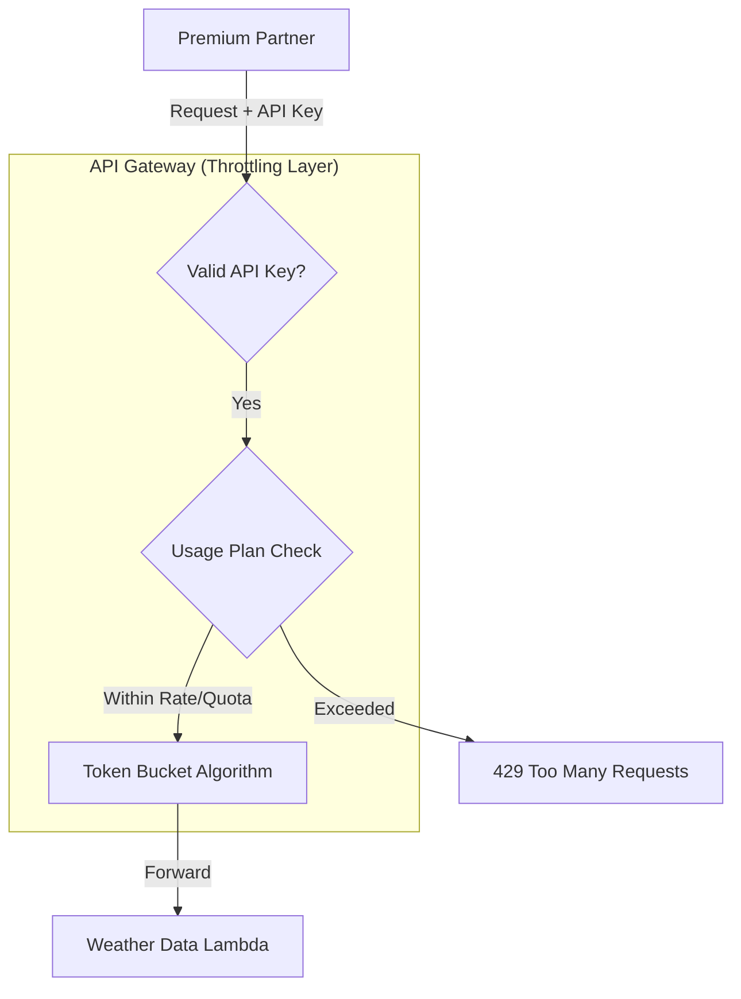

> **Jeff's Note**: While studying for the SAP exam, I kept confusing WAF rate-limiting with Usage Plans. This question is tricky because many people instinctively choose WAF for security, but for cost control without code changes, there's a better native pattern. Let's break it down.

## The Challenge (Simulated Question)

**Scenario:**
A SaaS startup provides a weather data API to a premium partner. The infrastructure uses **Amazon API Gateway** triggering **AWS Lambda** functions. Recently, the partner's automated testing scripts have caused massive traffic spikes, leading to an unacceptable increase in the monthly AWS bill. The startup's CTO has mandated a solution to cap the usage and costs immediately.

**Constraint:** The solution must be implemented **without modifying the existing Lambda function code**.

**Which solution meets these requirements most cost-effectively?**

* **A.** Integrate Amazon SQS to buffer the requests and configure a Lambda trigger with a reserved concurrency limit.
* **B.** Deploy an AWS WAF Web ACL, associate it with the API Gateway stage, and create a rate-based rule to block excess traffic.
* **C.** Configure an **API Gateway Usage Plan** with throttling limits and quotas, and associate it with an API Key provided to the partner.
* **D.** Rewrite the Lambda function to check a DynamoDB table for request counts and return a 429 error if the limit is exceeded.

---

## Architecture Visualized

---

## Analysis & Solution

**Correct Answer: C (Usage Plans & API Keys)**

The requirement is to **limit cost/usage** without **code changes**.

* **Why Option C works:** API Gateway **Usage Plans** are designed exactly for this "monetization" or "tenant isolation" use case. They allow you to define:
    1.  **Throttling:** Max requests per second (RPS) to protect your backend.
    2.  **Quotas:** Max requests per day/month to control the total bill.
    By enforcing this at the Gateway level, excess requests are rejected before they trigger the billable Lambda execution.

* **Why Option A fails:** Adding SQS changes the architecture from synchronous to asynchronous. This is a significant refactoring effort, violating the "no code changes" constraint.
* **Why Option B fails:** While AWS WAF can handle rate-limiting, it incurs additional costs per Web ACL and rule. It lacks the built-in "monthly quota" feature (e.g., 10,000 requests/month) that Usage Plans offer natively.
* **Why Option D fails:** This explicitly violates the "no code changes" constraint and adds latency/cost (DynamoDB reads) to every request.

---

## Exam Takeaway

If you need to limit API access for specific third-party clients based on **tiers, quotas, or cost** without touching backend code, **Usage Plans + API Keys** is the standard answer.

### Real World Reality

In the exam, answer 'Usage Plans'. But in a real production environment, I would actually recommend combining Usage Plans with WAF. Usage Plans save money, but WAF blocks malicious bots. For the exam constraints, however, stick to Option C.

> #### Disclaimer
> This is a study note based on simulated scenarios for the AWS SAP exam. It is not an official AWS question.
