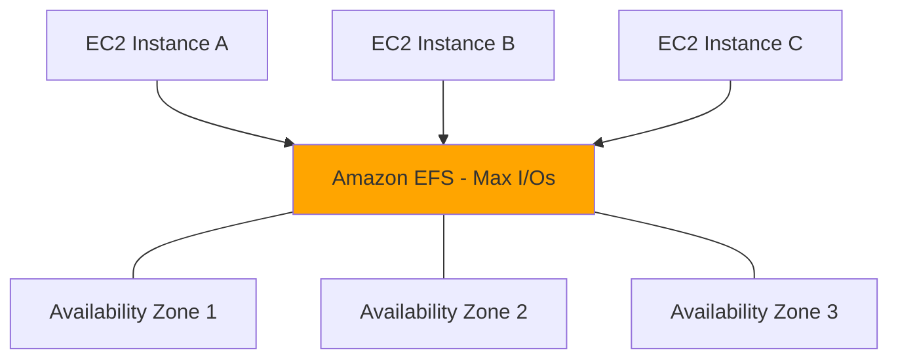

> Jeff's Note: While preparing for the **AWS SAP-C02** exam, many candidates grapple with understanding the nuances of shared storage options for distributed compute clusters. At its core, this is a classic trade-off analysis between **performance, durability, and cost control** in a multi-node architecture. Let's drill into a practical scenario where this decision becomes critical.

---

## The Architecture Drill

* **Scenario:**  
DataSphere Analytics, a startup specializing in fraud detection, is deploying a new big data processing cluster on AWS. The cluster consists of multiple Amazon Linux EC2 instances spread across several Availability Zones to ensure high availability. Each node runs analytics workloads that require concurrent read/write access to a shared file system. The storage must have POSIX-compliant file system semantics to support legacy applications and must deliver high throughput for intensive data ingestion and processing.

* **The Requirement:**  
Design a storage solution that provides a **highly available, elastic, POSIX-compliant shared file system capable of supporting concurrent read/write operations with high throughput across multiple EC2 instances in different AZs**, while maintaining operational simplicity and cost efficiency.

* **The Options:**  
  * A) Deploy a Storage Gateway File Gateway configured as an NFS share backed by Amazon S3, then mount this NFS share on all EC2 instances.  
  * B) Provision a new Amazon EFS file system using the General Purpose performance mode and mount it on every EC2 instance in the cluster.  
  * C) Create a single io2 EBS volume and attach it simultaneously to all EC2 instances in the cluster.  
  * D) Provision a new Amazon EFS file system using the Max I/O performance mode and mount it on every EC2 instance.

---

## The Decision Matrix

| Option | Est. Complexity | Est. Monthly Cost (Relative) | Pros                                               | Cons                                                        |
|--------|-----------------|------------------------------|----------------------------------------------------|-------------------------------------------------------------|
| A      | Medium          | Low ($50 - $100)             | Cost-effective; leverages S3 durability; NFS access | Performance bottleneck due to S3 consistency and throughput limits; not ideal for POSIX demands.             |
| B      | Low             | Medium ($200 - $400)         | Fully managed POSIX-compliant; General Purpose mode balances latency and throughput; highly available across AZs | Throughput capped at a moderate level; may face contention under heavy load.                               |
| C      | High            | Medium-High ($300+)           | Highest IOPS on a single node; strong consistency  | Cannot attach one EBS volume to multiple instances simultaneously; single point of failure; no multi-AZ support. |
| D      | Medium          | High ($400 - $600)           | Supports very high throughput and scale-out workloads; POSIX-compliant; multi-AZ available | Higher cost and slightly increased latency; Max I/O mode may increase complexity and pricing.                 |

---

## The Architect's Analysis

* **Correct Answer:** **Option D**

* **The Winning Logic:**  
Amazon EFS in Max I/O performance mode is explicitly designed for scale-out workloads requiring highly parallel access across many EC2 instances with strong POSIX semantics. It provides the highest throughput and IOPS to support demanding big data analytics tasks across Availability Zones. Though it costs more, it ensures performance at scale and operational simplicity without resorting to complex workarounds. This solution balances the operational risk, durability, and consistency requirements perfectly.

* **The Trap (Distractor Analysis):**  
  * **Why not Option A?**  
  Storage Gateway with S3 backend doesn’t provide true POSIX semantics, and its performance suffers because S3 is an object store with eventual consistency and high latency, unsuitable for concurrent writes and high-throughput workloads.  
  * **Why not Option B?**  
  General Purpose EFS mode provides good baseline performance at lower cost, but can become a bottleneck for very high throughput requirements common to big data clusters.  
  * **Why not Option C?**  
  EBS volumes cannot be simultaneously attached to multiple EC2 instances except under very limited and specific use cases (e.g., Amazon EBS Multi-Attach, which supports only certain instance types and not concurrent file system usage). This fails the multi-node shared storage requirement.

---

## The Blueprint (Architecture Visualization)

**Diagram Note:**  
Multiple EC2 instances distributed across Availability Zones concurrently mount and access the high-throughput, highly available Amazon EFS file system provisioned with Max I/O mode.

---

## Real-World Application

* **Exam Rule:**  
On the AWS SAP exam, whenever you see a multi-AZ, POSIX-compliant, high-throughput shared storage requirement for EC2 clusters, **always consider Amazon EFS Max I/O** as the primary solution.

* **Real World:**  
In practice, some organizations may balance cost and performance by starting with General Purpose mode EFS and scaling up to Max I/O as workloads demand. Also, they may factor in caching layers (like Amazon FSx Lustre or in-memory caches) for ultra-low latency needs, or use AWS DataSync for hybrid on-prem/cloud scenarios.

---

> **🚀 Master the Trade-offs, Become the Decision Maker.**  
>  
> Passing the exam is step one; mastering the strategic decision is step two. Don't miss the launch of our **Multi-Cloud FinOps Optimization Toolkit**.  
>  
> **👉 Subscribe to ADH Weekly Insights for exclusive early access and advanced strategy notifications!**
