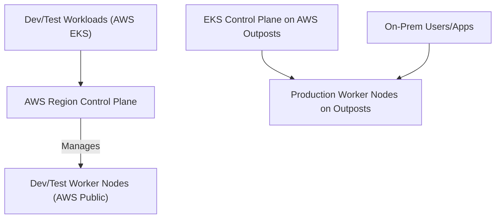

> ## Jeff's Notes
> 
> Unlike generic exam dumps, **Architect Decision Hub(ADH)** analyzes this scenario through the lens of a **Real-World CTO**, focusing on Trade-offs and FinOps impact.
> 
> While preparing for the **AWS SAP-C02**, many candidates get confused by **hybrid Kubernetes deployment strategies**. In the real world, this is fundamentally a decision about balancing **operational overhead vs. on-premises control** while maintaining AWS management benefits. Let's drill into a simulated scenario.

---

## The Blueprint: Target Solution

**Diagram Note:** Production workloads run on AWS Outposts racks locally with fully managed on-prem EKS control plane, while dev/test continues to run on public AWS EKS.

---

## The Architecture Drill

### **Scenario**  
NexGen Retail Solutions, a global retailer, operates a large corporate data center where they want to run production Kubernetes workloads locally due to strict data residency and latency needs. For their development and test environments, they use Amazon Elastic Kubernetes Service (EKS) clusters fully managed in AWS public regions.

With security policies requiring production control planes and worker nodes on-premises, NexGen needs an AWS-managed Kubernetes solution that supports local production workloads while minimizing operational complexity.

### **The Requirement**  
Design a hybrid Kubernetes environment that runs production EKS workloads on-premises with AWS-managed control plane services, while ensuring minimal ops overhead and freeing NexGen from managing Kubernetes upgrades and patching manually.

### **The Options**

**A**. Deploy AWS Outposts hardware racks in NexGen’s data center, then provision a locally deployed Amazon EKS cluster (with local control plane and data plane) on Outposts for production workloads.

**B**. Install Amazon EKS Anywhere on NexGen's existing on-prem servers without additional AWS hardware. Deploy production workloads on this cluster.

**C**. Deploy AWS Outposts hardware racks, and configure Amazon EKS in a "connected" extended cluster mode, with control plane extending into AWS regions but worker nodes running locally on Outposts.

**D**. Deploy AWS Outposts hardware in the data center, install Amazon EKS Anywhere on the Outposts servers, and run production workloads on the EKS Anywhere cluster.

---

## The Decision Matrix

| Option | Est. Complexity     | Est. Monthly Cost          | Pros                                                  | Cons                                                      |
|--------|---------------------|---------------------------|-------------------------------------------------------|-----------------------------------------------------------|
| A      | Medium-High         | High ($3,000+ monthly)    | Fully AWS managed with native EKS control plane on-prem, low ops overhead | High hardware and support cost; upfront minimum capacity required |
| B      | Low                 | Low ($0 additional AWS HW cost) | No additional hardware needed; flexible on existing infra | EKS Anywhere requires manual lifecycle management; more ops overhead |
| C      | High                | Moderate-High ($2,000+)   | Control plane runs in AWS (less local ops on control plane) | Complex hybrid config; latency and compliance risks; partial on-prem control |
| D      | Medium              | High ($2,500+)            | Combines Outposts HW & EKS Anywhere – best of both, simplified lifecycle | More complex setup; higher cost than EKS Anywhere alone  |

---

## The Architect's Analysis

### **Correct Answer**

**Option A**

### **The Winning Logic**  
Option A offers a fully managed Amazon EKS solution physically running on AWS Outposts hardware inside the company’s data center. This respects the requirement for production control plane and worker nodes to be on-prem while delivering the least operational overhead since AWS handles upgrades, patching, and availability of the Kubernetes control plane. The upfront hardware cost and ongoing support costs of Outposts are justified by lower ongoing Ops complexity and risk.

### **The Trap (Distractor Analysis)**

* **Why not Option B?**  
EKS Anywhere runs Kubernetes on existing hardware but requires manual cluster lifecycle management (upgrades, patching), increasing operational burden—which breaches the goal of minimal ops overhead. It’s cheaper but adds complexity for production workloads.

* **Why not Option C?**  
Moving the control plane into AWS while workers run locally introduces latency and network dependency risks and complicates compliance for data residency. Also, it deviates from the requirement for fully on-prem control plane and node presence.

* **Why not Option D?**  
Installing EKS Anywhere on Outposts hardware introduces unnecessary operational layers since Outposts with native EKS support already covers lifecycle management seamlessly. This option adds complexity without tangible ops benefits.

---

## Real-World Application

### **Exam Rule**  
For the exam, always pick **AWS Outposts native EKS** deployment when you see a requirement for fully on-prem Kubernetes with minimal operational overhead.

### **Real World**  
In practice, organizations sometimes use EKS Anywhere to leverage existing hardware or support non-Outposts environments, but at the cost of increased operational effort. Hybrid designs often involve tradeoffs around cost, compliance, and ops resources that go beyond exam scenarios.

---

## Call to Action

> **🚀 Master the Trade-offs, Become the Decision Maker.**
>
> Passing the exam is step one; mastering the strategic decision is step two. Don't miss the launch of our **Multi-Cloud FinOps Optimization Toolkit**.
>
> **👉 Subscribe to ADH Weekly Insights for exclusive early access and advanced strategy notifications!**
> 
 

---

## Disclaimer

This is a study note based on simulated scenarios for the **AWS SAP-C02** exam. It is not an official question from the certification body.
